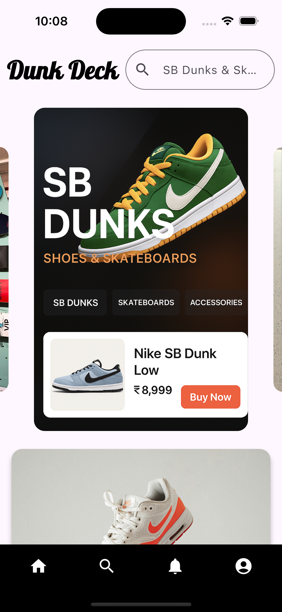
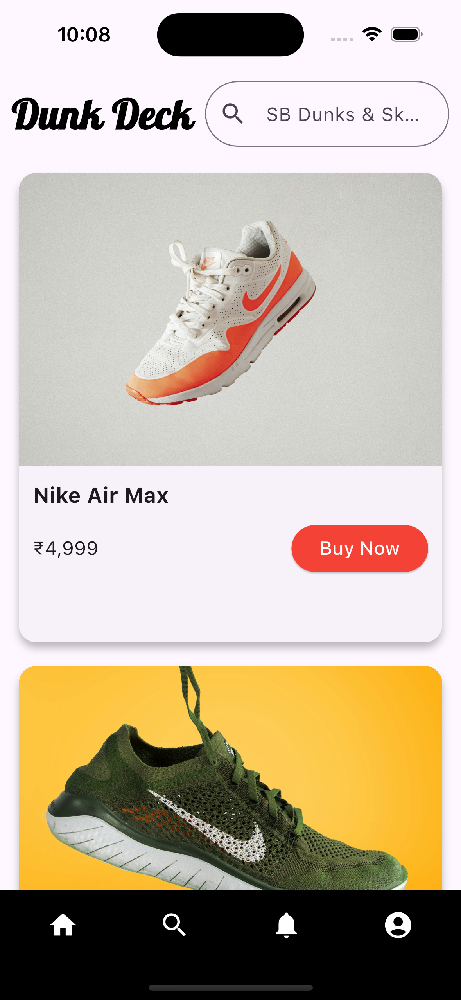
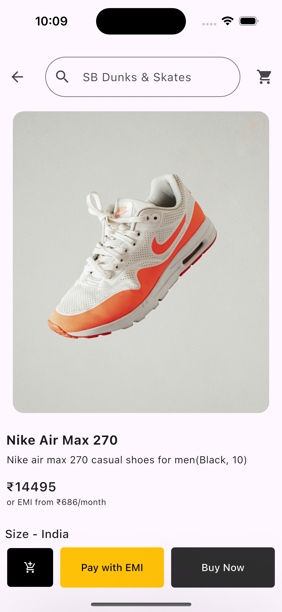
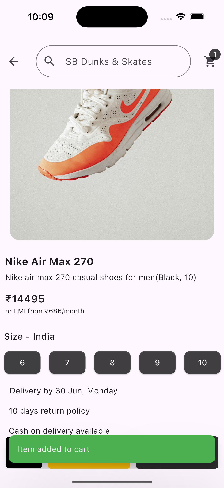
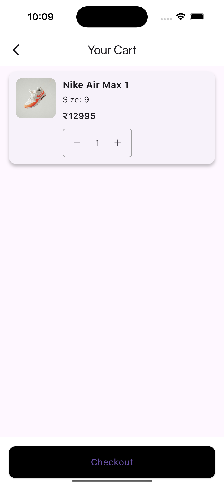

# Dunk Deck 🛹

Dunk Deck is a Flutter-based ecommerce app where users can explore and shop for shoes and skateboards.  
I built this project to practice **Flutter app development** and to create a complete shopping experience with a clean UI and smooth navigation.  

---

## Features
- Browse a product catalog (shoes and skateboards)  
- View product details with images and descriptions  
- Add items to the cart and update/remove them  
- Simple checkout flow (mock payment flow for now)  
- Responsive design for Android and iOS  

---

## Tech Stack
- **Framework**: Flutter (Dart)  
- **State Management**: Provider  
- **Local Storage**: SharedPreferences  
- **Platforms**: Android & iOS  

---

## Screenshots
<p align="center">
  
  
  
  
  
</p>

---

## Getting Started

```bash
git clone https://github.com/Aaron5194/dunk_deck_ecommerce-flutter.git
cd dunk_deck_ecommerce-flutter
flutter pub get
flutter run
```

## Author
**Aaron Pradeep**
aaronpradeep12@gmail.com
[LinkedIn](https://www.linkedin.com/in/aaron-pradeep/)

